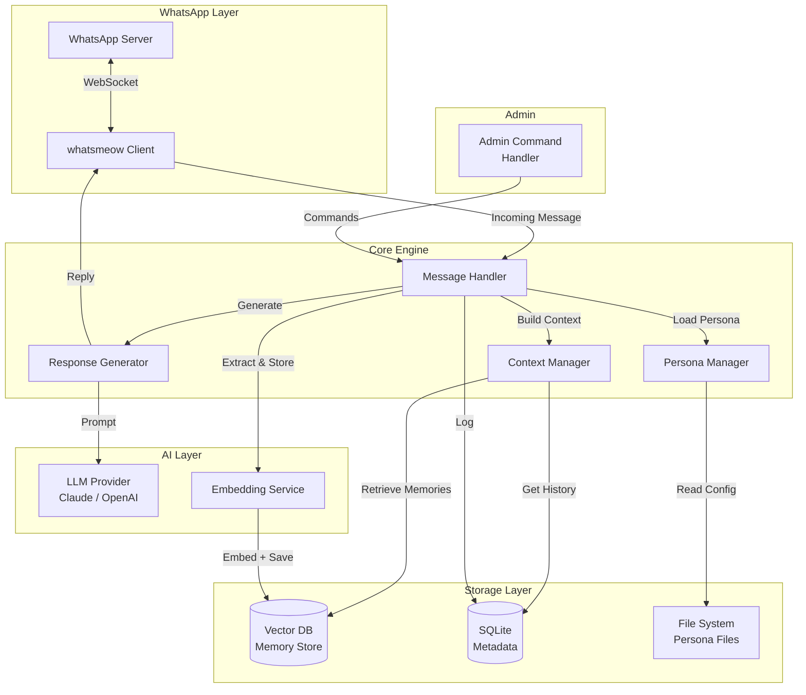
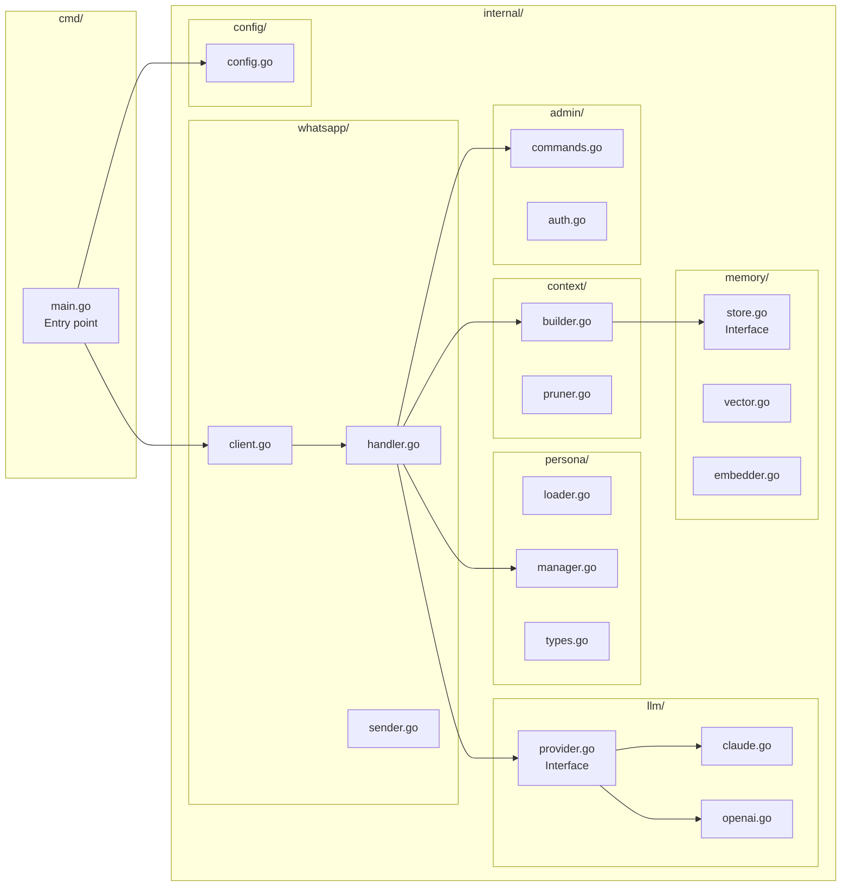
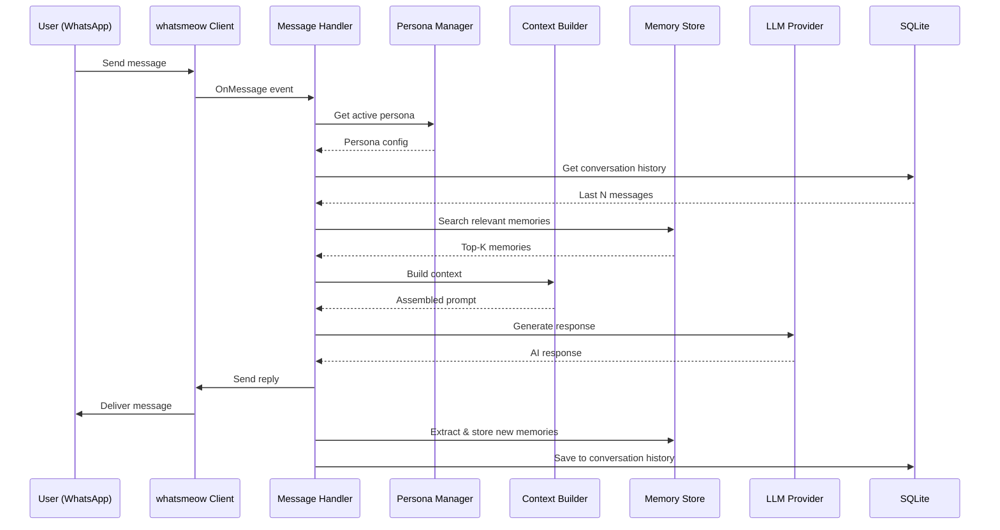
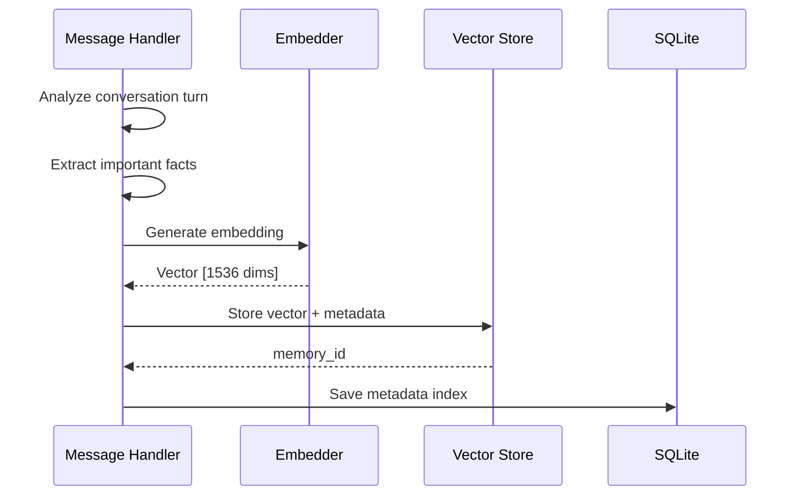

# Architecture Document — WA Persona AI

> Status: Draft
> Terakhir diperbarui: 2026-08-14
> Pemilik: Cloud-Dark

## 1. High-Level Architecture



## 2. Component Architecture



## 3. Project Structure

```
wa-persona-ai/
├── cmd/
│   └── wa-persona-ai/
│       └── main.go                 # Entry point
├── internal/
│   ├── whatsapp/
│   │   ├── client.go               # WhatsApp client (whatsmeow wrapper)
│   │   ├── handler.go              # Message event handler
│   │   └── sender.go               # Message sending utilities
│   ├── persona/
│   │   ├── loader.go               # Load persona from YAML files
│   │   ├── manager.go              # Persona lifecycle management
│   │   └── types.go                # Persona structs and interfaces
│   ├── llm/
│   │   ├── provider.go             # LLM provider interface
│   │   ├── claude.go               # Anthropic Claude implementation
│   │   ├── openai.go               # OpenAI GPT implementation
│   │   └── types.go                # Request/response types
│   ├── memory/
│   │   ├── store.go                # Vector store interface
│   │   ├── vector.go               # Vector DB implementation
│   │   ├── embedder.go             # Text embedding service
│   │   └── types.go                # Memory entry types
│   ├── context/
│   │   ├── builder.go              # Context assembly for LLM
│   │   └── pruner.go               # Token-aware context pruning
│   ├── admin/
│   │   ├── commands.go             # Admin command handlers
│   │   └── auth.go                 # Admin authentication
│   └── config/
│       └── config.go               # Configuration management
├── persona/                         # Persona definition files
│   ├── _schema.yaml                # Persona YAML schema
│   ├── default.yaml                # Default persona
│   └── examples/
│       ├── assistant.yaml
│       ├── customer-service.yaml
│       └── companion.yaml
├── memory/                          # Memory data directory
│   ├── vectors/                    # Vector DB storage
│   └── metadata.db                 # SQLite metadata
├── docs/                            # Documentation
├── config/
│   └── config.example.yaml         # Example configuration
├── scripts/
│   └── setup.sh                    # Setup script
├── go.mod
├── go.sum
├── Dockerfile
├── docker-compose.yml
├── Makefile
├── .env.example
├── .gitignore
└── README.md
```

## 4. Data Flow

### 4.1 Message Processing Flow



### 4.2 Memory Storage Flow



## 5. Keputusan Arsitektur

| # | Keputusan | Konteks | Alternatif yang Ditolak |
|---|---|---|---|
| AD-001 | Go sebagai bahasa utama | Performance, single binary, concurrency | Node.js (heavier runtime), Python (slower) |
| AD-002 | whatsmeow untuk WhatsApp | Native Go, multi-device, maintained | Baileys (Node.js), selenium-based |
| AD-003 | Embedded vector DB | Simplicity, no infra dependency | Hosted Pinecone (cost, dependency) |
| AD-004 | Interface-based provider | Extensibility, testability | Hardcoded single provider |
| AD-005 | Persona as YAML files | Human-readable, version-controllable | Database-stored (harder to manage) |
| AD-006 | SQLite for metadata | Zero-config, embedded, reliable | PostgreSQL (overkill for single instance) |

## 6. Referensi

- Lihat [04_TRD.md](04_TRD.md) untuk tech stack detail
- Lihat [03_FRD.md](03_FRD.md) untuk kebutuhan fungsional
- Lihat [06_IMPLEMENTATION_PLAN.md](06_IMPLEMENTATION_PLAN.md) untuk fase implementasi
