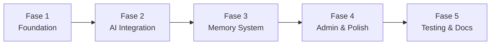

# Implementation Plan — WA Persona AI

> Status: Draft
> Terakhir diperbarui: 2026-08-14
> Pemilik: Cloud-Dark

## 1. Overview

Implementasi dibagi menjadi 5 fase dengan total estimasi 8 minggu. Setiap fase memiliki deliverable yang jelas dan bisa di-demo.

## 2. Fase Implementasi

### Fase 1: Foundation (Minggu 1-2)

**Tujuan:** Bot dapat terhubung ke WhatsApp dan membalas pesan sederhana.

| # | Task | File | Dependensi | Estimasi |
|---|---|---|---|---|
| 1.1 | Inisialisasi Go module | `go.mod`, `go.sum` | - | 1 jam |
| 1.2 | Setup project structure | `cmd/`, `internal/` | 1.1 | 2 jam |
| 1.3 | Implementasi WhatsApp client | `internal/whatsapp/client.go` | 1.2 | 4 jam |
| 1.4 | Implementasi message handler | `internal/whatsapp/handler.go` | 1.3 | 4 jam |
| 1.5 | Implementasi message sender | `internal/whatsapp/sender.go` | 1.3 | 2 jam |
| 1.6 | Konfigurasi management | `internal/config/config.go` | 1.2 | 3 jam |
| 1.7 | Basic logging setup | Di semua module | 1.2 | 2 jam |
| 1.8 | Echo bot (reply = input) | `cmd/wa-persona-ai/main.go` | 1.3-1.5 | 2 jam |
| 1.9 | Dockerfile + docker-compose | Root files | 1.8 | 2 jam |

**Deliverable:** Bot yang bisa login via QR code dan echo pesan kembali.

### Fase 2: AI Integration (Minggu 3-4)

**Tujuan:** Bot membalas dengan respons AI menggunakan persona dasar.

| # | Task | File | Dependensi | Estimasi |
|---|---|---|---|---|
| 2.1 | LLM provider interface | `internal/llm/provider.go` | Fase 1 | 2 jam |
| 2.2 | Claude API client | `internal/llm/claude.go` | 2.1 | 4 jam |
| 2.3 | OpenAI API client | `internal/llm/openai.go` | 2.1 | 4 jam |
| 2.4 | Persona types & schema | `internal/persona/types.go` | Fase 1 | 2 jam |
| 2.5 | Persona YAML loader | `internal/persona/loader.go` | 2.4 | 3 jam |
| 2.6 | Persona manager | `internal/persona/manager.go` | 2.5 | 3 jam |
| 2.7 | Default persona file | `persona/default.yaml` | 2.4 | 1 jam |
| 2.8 | Context builder (basic) | `internal/context/builder.go` | 2.1, 2.6 | 4 jam |
| 2.9 | Integrasi handler + LLM | `internal/whatsapp/handler.go` | 2.1-2.8 | 4 jam |

**Deliverable:** Bot yang membalas dengan AI response sesuai persona default.

### Fase 3: Memory System (Minggu 5-6)

**Tujuan:** Bot memiliki long-term memory dan bisa mengingat percakapan lama.

| # | Task | File | Dependensi | Estimasi |
|---|---|---|---|---|
| 3.1 | Memory types | `internal/memory/types.go` | Fase 2 | 2 jam |
| 3.2 | Embedding service | `internal/memory/embedder.go` | 3.1 | 4 jam |
| 3.3 | Vector store interface | `internal/memory/store.go` | 3.1 | 2 jam |
| 3.4 | Vector DB implementation | `internal/memory/vector.go` | 3.3 | 8 jam |
| 3.5 | Memory extraction logic | `internal/memory/extractor.go` | 3.4 | 6 jam |
| 3.6 | Memory retrieval + ranking | `internal/memory/retriever.go` | 3.4 | 4 jam |
| 3.7 | Context builder + memory | `internal/context/builder.go` | 3.6 | 4 jam |
| 3.8 | SQLite metadata store | `internal/memory/metadata.go` | 3.1 | 3 jam |
| 3.9 | Memory cleanup job | `internal/memory/cleanup.go` | 3.8 | 2 jam |

**Deliverable:** Bot yang mengingat informasi dari percakapan sebelumnya.

### Fase 4: Admin & Polish (Minggu 7)

**Tujuan:** Admin commands, multi-persona, rate limiting.

| # | Task | File | Dependensi | Estimasi |
|---|---|---|---|---|
| 4.1 | Admin authentication | `internal/admin/auth.go` | Fase 3 | 2 jam |
| 4.2 | Admin commands | `internal/admin/commands.go` | 4.1 | 6 jam |
| 4.3 | Multi-persona support | `internal/persona/manager.go` | 4.2 | 4 jam |
| 4.4 | Example persona files | `persona/examples/` | 4.3 | 3 jam |
| 4.5 | Rate limiting | `internal/whatsapp/ratelimit.go` | Fase 3 | 3 jam |
| 4.6 | Error handling improvement | Semua module | - | 4 jam |
| 4.7 | Graceful shutdown | `cmd/wa-persona-ai/main.go` | - | 2 jam |
| 4.8 | Context pruning | `internal/context/pruner.go` | - | 3 jam |

**Deliverable:** Bot production-ready dengan admin controls.

### Fase 5: Testing & Documentation (Minggu 8)

**Tujuan:** Test coverage, documentation, release preparation.

| # | Task | File | Dependensi | Estimasi |
|---|---|---|---|---|
| 5.1 | Unit tests - persona | `internal/persona/*_test.go` | Fase 4 | 4 jam |
| 5.2 | Unit tests - memory | `internal/memory/*_test.go` | Fase 4 | 4 jam |
| 5.3 | Unit tests - LLM | `internal/llm/*_test.go` | Fase 4 | 4 jam |
| 5.4 | Integration tests | `tests/integration/` | 5.1-5.3 | 6 jam |
| 5.5 | README update | `README.md` | - | 3 jam |
| 5.6 | API documentation | `docs/` | - | 4 jam |
| 5.7 | Example configurations | `config/`, `persona/` | - | 2 jam |
| 5.8 | Release v0.1.0 | Tags, releases | 5.1-5.7 | 2 jam |

**Deliverable:** v0.1.0 release dengan test dan documentation.

## 3. Dependency Graph

## 4. Risiko Implementasi

| Risiko | Likelihood | Mitigasi |
|---|---|---|
| whatsmeow breaking change | Medium | Pin version, monitor releases |
| LLM API downtime | Low | Multi-provider fallback |
| Vector DB performance | Low | Benchmark early, indexing strategy |
| WhatsApp ban | Medium | Rate limiting, natural behavior |

## 5. Referensi

- Lihat [05_ARCHITECTURE.md](05_ARCHITECTURE.md) untuk arsitektur
- Lihat [07_MASTER_CHECKLIST.md](07_MASTER_CHECKLIST.md) untuk progress tracking
- Lihat [08_ROADMAP.md](08_ROADMAP.md) untuk timeline visual
