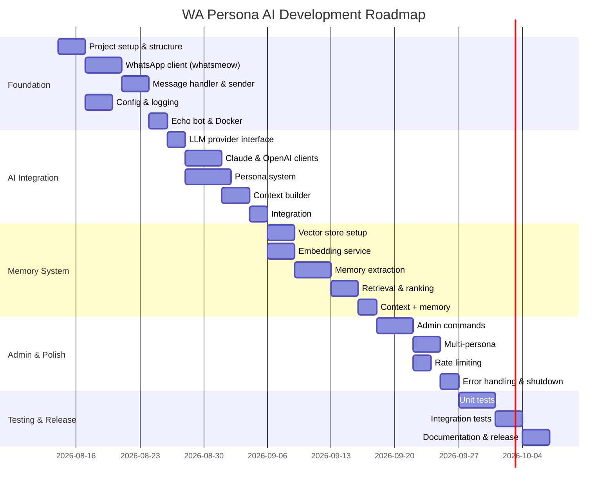

# Roadmap — WA Persona AI

> Status: Draft
> Terakhir diperbarui: 2026-08-14
> Pemilik: Cloud-Dark

## Timeline Overview

## Milestone Breakdown

### Q3 2026 — MVP Release

| Milestone | Target | Status |
|---|---|---|
| 🚧 M1: Echo Bot | 2026-08-28 | 📋 Planned |
| 📋 M2: AI Reply | 2026-09-11 | 📋 Planned |
| 📋 M3: Memory System | 2026-09-25 | 📋 Planned |
| 📋 M4: Admin Controls | 2026-10-02 | 📋 Planned |
| 📋 M5: v0.1.0 Release | 2026-10-09 | 📋 Planned |

### Q4 2026 — Enhancement

| Milestone | Target | Status |
|---|---|---|
| 📋 M6: Group Chat Support | 2026-10-30 | 📋 Planned |
| 📋 M7: Media Handling | 2026-11-15 | 📋 Planned |
| 📋 M8: Plugin System | 2026-12-01 | 📋 Planned |
| 📋 M9: Web Dashboard | 2026-12-31 | 📋 Planned |

### Q1 2027 — Scale

| Milestone | Target | Status |
|---|---|---|
| 📋 M10: Multi-instance | 2027-01-31 | 📋 Planned |
| 📋 M11: Analytics | 2027-02-28 | 📋 Planned |
| 📋 M12: v1.0.0 Release | 2027-03-31 | 📋 Planned |

## Status Legend

| Icon | Status |
|---|---|
| ✅ | Completed |
| 🚧 | In Progress |
| 📋 | Planned |
| ❌ | Cancelled |
| ⏸️ | On Hold |

## Referensi

- Lihat [06_IMPLEMENTATION_PLAN.md](06_IMPLEMENTATION_PLAN.md) untuk detail implementasi
- Lihat [07_MASTER_CHECKLIST.md](07_MASTER_CHECKLIST.md) untuk progress tracking
