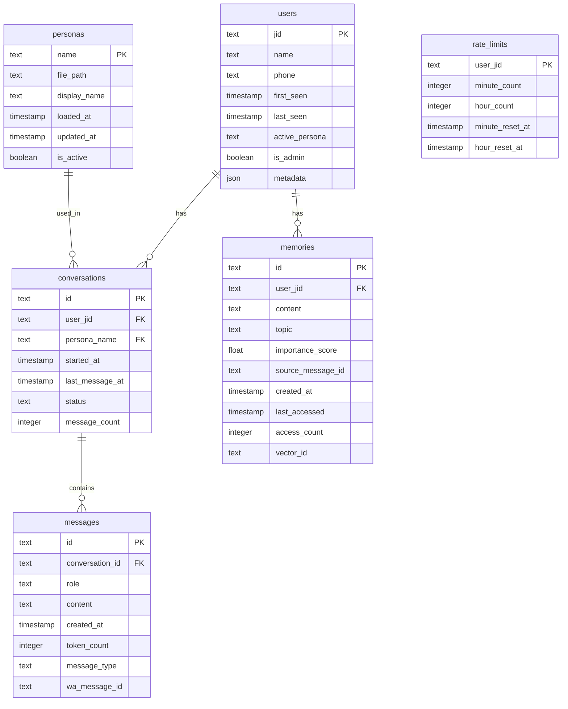

# Database Design — WA Persona AI

> Status: Draft
> Terakhir diperbarui: 2026-08-14
> Pemilik: Cloud-Dark

## 1. Overview

WA Persona AI menggunakan dua jenis storage:
- **SQLite** — Metadata, conversation history, user data
- **Vector DB (chromem-go)** — Memory embeddings untuk semantic search

## 2. SQLite Schema

### 2.1 Entity Relationship Diagram



### 2.2 Table Definitions

#### `users`
```sql
CREATE TABLE users (
    jid TEXT PRIMARY KEY,              -- WhatsApp JID (e.g., 6281234567890@s.whatsapp.net)
    name TEXT,                         -- Display name (from WhatsApp or self-introduced)
    phone TEXT,                        -- Phone number
    first_seen TIMESTAMP DEFAULT CURRENT_TIMESTAMP,
    last_seen TIMESTAMP DEFAULT CURRENT_TIMESTAMP,
    active_persona TEXT DEFAULT 'default',
    is_admin BOOLEAN DEFAULT FALSE,
    metadata JSON DEFAULT '{}',
    created_at TIMESTAMP DEFAULT CURRENT_TIMESTAMP,
    updated_at TIMESTAMP DEFAULT CURRENT_TIMESTAMP
);
```

#### `conversations`
```sql
CREATE TABLE conversations (
    id TEXT PRIMARY KEY,               -- UUID
    user_jid TEXT NOT NULL,
    persona_name TEXT NOT NULL DEFAULT 'default',
    started_at TIMESTAMP DEFAULT CURRENT_TIMESTAMP,
    last_message_at TIMESTAMP DEFAULT CURRENT_TIMESTAMP,
    status TEXT DEFAULT 'active',      -- 'active', 'archived', 'reset'
    message_count INTEGER DEFAULT 0,
    FOREIGN KEY (user_jid) REFERENCES users(jid),
    FOREIGN KEY (persona_name) REFERENCES personas(name)
);

CREATE INDEX idx_conversations_user ON conversations(user_jid);
CREATE INDEX idx_conversations_status ON conversations(status);
```

#### `messages`
```sql
CREATE TABLE messages (
    id TEXT PRIMARY KEY,               -- UUID
    conversation_id TEXT NOT NULL,
    role TEXT NOT NULL,                 -- 'user', 'assistant', 'system'
    content TEXT NOT NULL,
    created_at TIMESTAMP DEFAULT CURRENT_TIMESTAMP,
    token_count INTEGER DEFAULT 0,
    message_type TEXT DEFAULT 'text',   -- 'text', 'image', 'audio', 'command'
    wa_message_id TEXT,                 -- WhatsApp message ID for reference
    FOREIGN KEY (conversation_id) REFERENCES conversations(id)
);

CREATE INDEX idx_messages_conversation ON messages(conversation_id);
CREATE INDEX idx_messages_created ON messages(created_at);
```

#### `memories`
```sql
CREATE TABLE memories (
    id TEXT PRIMARY KEY,               -- UUID
    user_jid TEXT NOT NULL,
    content TEXT NOT NULL,              -- The remembered fact
    topic TEXT,                         -- Category/topic of the memory
    importance_score REAL DEFAULT 0.5,  -- 0.0 - 1.0
    source_message_id TEXT,            -- Message that generated this memory
    created_at TIMESTAMP DEFAULT CURRENT_TIMESTAMP,
    last_accessed TIMESTAMP DEFAULT CURRENT_TIMESTAMP,
    access_count INTEGER DEFAULT 0,
    vector_id TEXT,                     -- Reference to vector DB entry
    FOREIGN KEY (user_jid) REFERENCES users(jid)
);

CREATE INDEX idx_memories_user ON memories(user_jid);
CREATE INDEX idx_memories_topic ON memories(topic);
CREATE INDEX idx_memories_importance ON memories(importance_score);
CREATE INDEX idx_memories_created ON memories(created_at);
```

#### `rate_limits`
```sql
CREATE TABLE rate_limits (
    user_jid TEXT PRIMARY KEY,
    minute_count INTEGER DEFAULT 0,
    hour_count INTEGER DEFAULT 0,
    minute_reset_at TIMESTAMP,
    hour_reset_at TIMESTAMP,
    FOREIGN KEY (user_jid) REFERENCES users(jid)
);
```

## 3. Vector DB Schema

### 3.1 Collection: `memories`

| Field | Type | Description |
|---|---|---|
| id | string | UUID, matches `memories.vector_id` in SQLite |
| embedding | float32[1536] | Text embedding vector |
| content | string (metadata) | Original text content |
| user_jid | string (metadata) | Owner user JID |
| topic | string (metadata) | Memory topic |
| importance | float32 (metadata) | Importance score |
| created_at | string (metadata) | ISO 8601 timestamp |

### 3.2 Index Configuration

```go
// chromem-go collection config
collection := db.CreateCollection("memories", nil, chromem.WithEmbeddingFunc(embeddingFunc))
```

## 4. Data Flow

```
User Message → Parse → Store in messages table
                    ↓
              Extract Facts → Generate Embedding → Store in Vector DB
                                                 → Store metadata in memories table
                    ↓
              Retrieve relevant memories → Cosine similarity search
                    ↓
              Build context → Send to LLM → Store response in messages table
```

## 5. Migration Strategy

- Migrasi menggunakan embedded SQL di Go (auto-run saat startup)
- Version tracking di tabel `schema_migrations`
- Backward-compatible migrations only
- No data-destructive migrations tanpa backup

## 6. Referensi

- Lihat [05_ARCHITECTURE.md](05_ARCHITECTURE.md) untuk arsitektur
- Lihat [04_TRD.md](04_TRD.md) untuk tech stack
