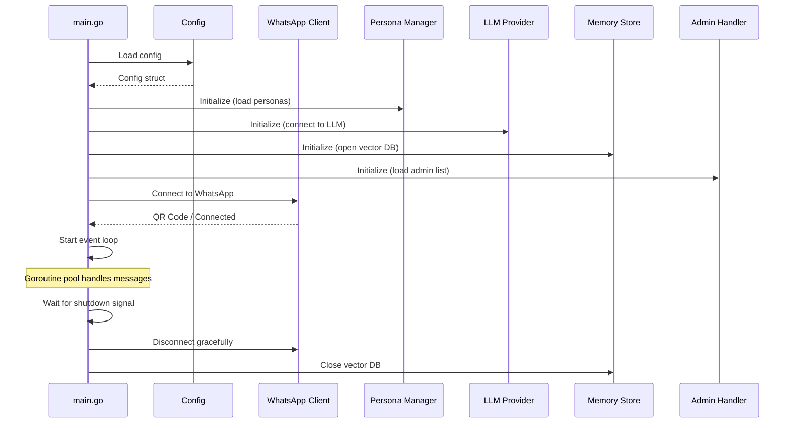

# Backend Design — WA Persona AI

> Status: Draft
> Terakhir diperbarui: 2026-08-14
> Pemilik: Cloud-Dark

## 1. Overview

Backend WA Persona AI dibangun dengan Go menggunakan arsitektur modular. Setiap module memiliki responsibility yang jelas dan berkomunikasi melalui interface.

## 2. Module Design

### 2.1 Application Lifecycle



### 2.2 Message Processing Pipeline

```go
// Simplified pipeline
func (h *Handler) OnMessage(evt *events.Message) {
    // 1. Parse message
    msg := ParseMessage(evt)

    // 2. Check rate limit
    if !h.rateLimiter.Allow(msg.SenderJID) {
        return // silently drop
    }

    // 3. Check admin command
    if h.admin.IsCommand(msg.Text) {
        if h.admin.IsAdmin(msg.SenderJID) {
            h.admin.Execute(msg)
        } else {
            h.reply(msg, "Maaf, command ini hanya untuk admin.")
        }
        return
    }

    // 4. Get or create conversation
    conv := h.conversations.GetOrCreate(msg.SenderJID)

    // 5. Get active persona
    persona := h.personas.GetActive(msg.SenderJID)

    // 6. Retrieve relevant memories
    memories := h.memory.Search(msg.Text, msg.SenderJID, 5)

    // 7. Build context
    ctx := h.contextBuilder.Build(persona, conv.History, memories, msg)

    // 8. Generate response
    response := h.llm.Generate(ctx)

    // 9. Send reply
    h.sendTypingAndReply(msg, response)

    // 10. Save to history
    conv.AddMessage("user", msg.Text)
    conv.AddMessage("assistant", response)

    // 11. Extract and store new memories (async)
    go h.memory.ExtractAndStore(msg.SenderJID, msg.Text, response)
}
```

### 2.3 Key Interfaces

```go
// internal/llm/provider.go
type Provider interface {
    Generate(ctx context.Context, req *Request) (*Response, error)
    CountTokens(messages []Message) (int, error)
    MaxContextTokens() int
    Name() string
}

// internal/memory/store.go
type Store interface {
    Store(ctx context.Context, entry *Entry) error
    Search(ctx context.Context, query string, userJID string, topK int) ([]*Result, error)
    Delete(ctx context.Context, filter *Filter) error
    Stats(ctx context.Context) (*Stats, error)
    Close() error
}

// internal/persona/manager.go
type Manager interface {
    Get(name string) (*Persona, error)
    GetActive(userJID string) *Persona
    SetActive(userJID string, name string) error
    List() []string
    Reload() error
}

// internal/context/builder.go
type Builder interface {
    Build(persona *Persona, history []Message, memories []*memory.Result, current *Message) *LLMRequest
}
```

## 3. Error Handling Strategy

```go
// Custom error types
type AppError struct {
    Code    string
    Message string
    Err     error
}

// Error codes
const (
    ErrLLMTimeout     = "LLM_TIMEOUT"
    ErrLLMRateLimit   = "LLM_RATE_LIMIT"
    ErrPersonaNotFound = "PERSONA_NOT_FOUND"
    ErrMemoryFull     = "MEMORY_FULL"
    ErrWADisconnected = "WA_DISCONNECTED"
)

// Graceful error handling in message pipeline
func (h *Handler) handleWithRecovery(msg *Message) {
    defer func() {
        if r := recover(); r != nil {
            log.Error().Interface("panic", r).Msg("recovered from panic")
            h.reply(msg, "Maaf, terjadi kesalahan internal.")
        }
    }()
    h.processMessage(msg)
}
```

## 4. Concurrency Model

```
                    ┌─────────────────┐
                    │  WhatsApp Events │
                    └────────┬────────┘
                             │
                    ┌────────▼────────┐
                    │  Event Router   │
                    └────────┬────────┘
                             │
            ┌────────────────┼────────────────┐
            │                │                │
    ┌───────▼───────┐ ┌─────▼─────┐ ┌───────▼───────┐
    │ Worker Pool   │ │ Worker    │ │ Worker Pool   │
    │ (Messages)    │ │ (Admin)   │ │ (Memory)      │
    │ Buffered Chan │ │ Direct    │ │ Async Extract │
    └───────────────┘ └───────────┘ └───────────────┘
```

- **Message workers:** Bounded goroutine pool (configurable, default 10)
- **Memory extraction:** Fire-and-forget goroutines with error logging
- **Rate limiter:** Token bucket per user, checked before entering worker pool
- **Shared state:** Protected with `sync.RWMutex` (conversation map, persona cache)

## 5. Configuration Loading

```go
// Priority order (highest wins):
// 1. Environment variables (WPA_*)
// 2. Config file (config/config.yaml)
// 3. Default values

type Config struct {
    WhatsApp  WhatsAppConfig  `yaml:"whatsapp"`
    LLM       LLMConfig       `yaml:"llm"`
    Persona   PersonaConfig   `yaml:"persona"`
    Memory    MemoryConfig    `yaml:"memory"`
    Context   ContextConfig   `yaml:"context"`
    Admin     AdminConfig     `yaml:"admin"`
    RateLimit RateLimitConfig `yaml:"rate_limit"`
    Logging   LoggingConfig   `yaml:"logging"`
}
```

## 6. Referensi

- Lihat [05_ARCHITECTURE.md](05_ARCHITECTURE.md) untuk high-level architecture
- Lihat [20_DATABASE.md](20_DATABASE.md) untuk database design
- Lihat [04_TRD.md](04_TRD.md) untuk technical requirements
