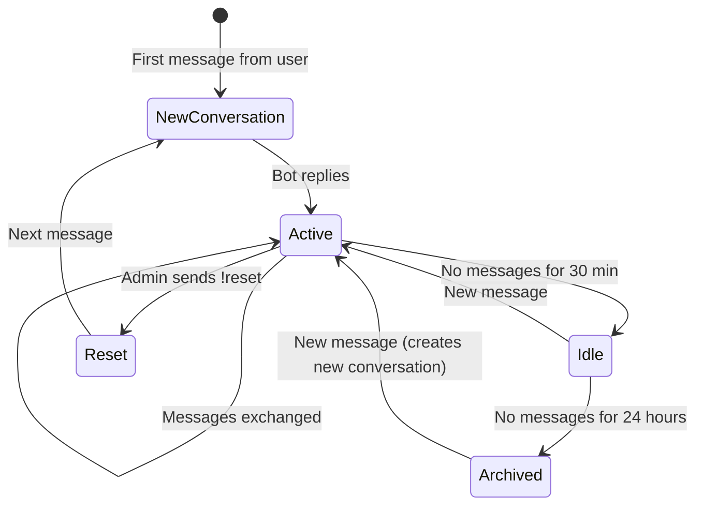

# Memory Conversation History Design — WA Persona AI

> Status: Draft
> Terakhir diperbarui: 2026-08-14
> Pemilik: Cloud-Dark

## 1. Two-Tier Memory Architecture

WA Persona AI menggunakan dua tier memory:

### Tier 1: Short-Term Memory (Conversation History)
- **Storage:** SQLite `messages` table
- **Scope:** Last N messages in current conversation
- **Purpose:** Maintain immediate conversational context
- **Retention:** Configurable (default: last 20 messages)
- **Access:** Direct lookup by conversation_id

### Tier 2: Long-Term Memory (Vector DB)
- **Storage:** Vector database (chromem-go)
- **Scope:** Important facts extracted over all conversations
- **Purpose:** Persistent knowledge about the user
- **Retention:** Configurable (default: 90 days)
- **Access:** Semantic search by similarity

## 2. How They Work Together

```
Incoming Message
      │
      ├──→ [Short-Term] Get last 20 messages for context
      │        → Recent conversation flow
      │
      ├──→ [Long-Term] Search relevant memories
      │        → "User's name is Budi"
      │        → "User likes programming in Go"
      │        → "User works at BCA"
      │
      └──→ [Context Builder] Assembles:
               1. System Prompt (from persona)
               2. Relevant Long-Term Memories
               3. Recent Conversation History
               4. Current Message
               → Send to LLM
```

## 3. Context Assembly Priority

When token budget is limited, content is pruned in this order (last = first to remove):

```
Priority 1 (Never removed):  System Prompt
Priority 2 (Keep if possible): Current message
Priority 3 (Keep if possible): Last 3 messages (immediate context)
Priority 4 (May be pruned):    Relevant long-term memories
Priority 5 (First to prune):   Older conversation history (messages 4-20)
```

## 4. Conversation Lifecycle



## 5. Memory Extraction Pipeline

```
Conversation Turn:
  User: "Aku baru pindah ke Bandung minggu lalu, sekarang kerja di Tokopedia"
  Bot:  "Oh keren! Gimana Bandung? Tokopedia kantornya di mana ya di Bandung?"

Extraction:
  Fact 1: "User recently moved to Bandung" 
    → topic: personal_info, importance: 0.8
  Fact 2: "User works at Tokopedia"
    → topic: personal_info, importance: 0.9

Deduplication Check:
  - Existing memory: "User lives in Jakarta" → CONFLICT → Update to "User moved to Bandung"
  - No existing work info → INSERT new memory

Storage:
  → Vector DB: embed + store both facts
  → SQLite: store metadata (topic, importance, source message)
```

## 6. Referensi

- Lihat [memory/README.md](README.md) untuk overview lengkap
- Lihat [memory/EMBEDDING_STRATEGY.md](EMBEDDING_STRATEGY.md) untuk strategi embedding
- Lihat [../docs/20_DATABASE.md](../docs/20_DATABASE.md) untuk database schema
