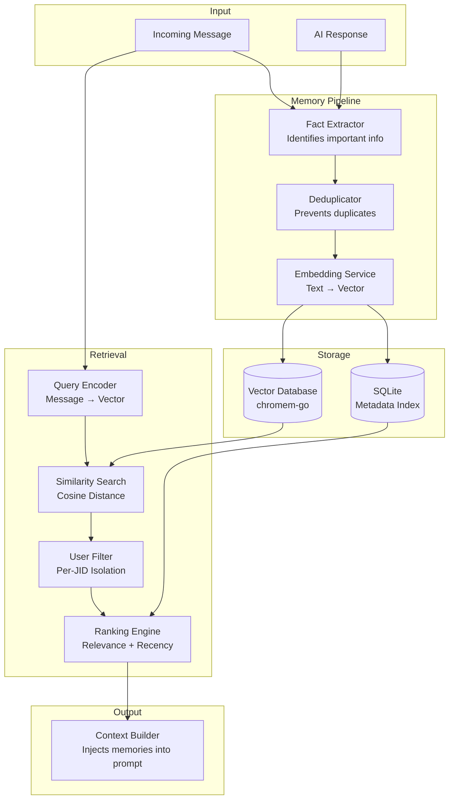

# Memory System Documentation — WA Persona AI

> Status: Draft
> Terakhir diperbarui: 2026-08-14
> Pemilik: Cloud-Dark

## 1. Overview

Memory system memberikan kemampuan long-term memory kepada AI, sehingga bot dapat mengingat informasi dari percakapan sebelumnya. Sistem ini menggunakan vector database untuk semantic search — memungkinkan recall berdasarkan makna, bukan keyword exact match.

## 2. Architecture



## 3. How It Works

### 3.1 Memory Storage (Write Path)

1. **Fact Extraction:** Setelah setiap conversation turn, sistem menganalisis pesan user dan respons AI untuk mengekstrak fakta penting.

2. **Importance Scoring:** Setiap fakta diberi skor penting (0.0 - 1.0):
   - `0.9-1.0` — Personal identity (nama, umur, pekerjaan)
   - `0.7-0.8` — Preferences (suka/tidak suka, hobi)
   - `0.5-0.6` — Events (cerita, kejadian)
   - `0.3-0.4` — Opinions (pendapat tentang sesuatu)
   - `< 0.3` — Casual conversation (tidak disimpan)

3. **Deduplication:** Cek apakah fakta serupa sudah ada di memory. Jika sudah, update timestamp dan importance score, bukan tambah entry baru.

4. **Embedding:** Convert text ke vector embedding (1536 dimensi menggunakan OpenAI Ada-002 atau model lokal).

5. **Storage:** Simpan vector di vector DB dan metadata di SQLite.

### 3.2 Memory Retrieval (Read Path)

1. **Query Encoding:** Pesan masuk diconvert ke vector embedding.

2. **Similarity Search:** Cari top-K vectors yang paling mirip menggunakan cosine similarity.

3. **User Filtering:** Filter hasil hanya untuk user yang sedang berkomunikasi (JID-based isolation).

4. **Ranking:** Re-rank results dengan formula:
   ```
   final_score = (similarity * 0.6) + (recency * 0.2) + (importance * 0.1) + (access_frequency * 0.1)
   ```

5. **Context Injection:** Memory yang relevan dimasukkan ke prompt LLM sebagai bagian dari context.

## 4. Data Schema

### Vector Entry

```
{
    id:         "mem_uuid",
    vector:     float32[1536],          // Embedding vector
    metadata: {
        content:    "User's name is Budi",
        user_jid:   "6281234567890@s.whatsapp.net",
        topic:      "personal_info",
        importance: 0.9,
        created_at: "2026-08-14T10:30:00Z"
    }
}
```

### SQLite Metadata

```sql
-- See docs/20_DATABASE.md for full schema
SELECT id, content, topic, importance_score, created_at, access_count
FROM memories
WHERE user_jid = ?
ORDER BY importance_score DESC;
```

## 5. Memory Topics

| Topic | Deskripsi | Contoh |
|---|---|---|
| `personal_info` | Informasi identitas | Nama, umur, pekerjaan, lokasi |
| `preference` | Suka/tidak suka | Makanan favorit, hobi, genre musik |
| `event` | Kejadian/cerita | "Kemarin presentasi di kantor" |
| `relationship` | Hubungan dengan orang lain | "Punya adik namanya Ani" |
| `opinion` | Pendapat | "Menurutku React lebih baik dari Vue" |
| `goal` | Tujuan/rencana | "Mau belajar bahasa Jepang" |
| `emotional` | Status emosional | "Lagi stres karena deadline" |
| `factual` | Fakta yang dibagikan | "Bumi berputar 1670 km/jam" |

## 6. Configuration

```yaml
# config/config.yaml
memory:
  enabled: true

  # Storage
  vector_dir: "./data/memory/vectors"
  metadata_db: "./data/memory/metadata.db"

  # Embedding
  embedding:
    provider: "openai"              # "openai" | "local"
    model: "text-embedding-ada-002"
    dimensions: 1536
    batch_size: 10                  # Batch embedding requests

  # Retrieval
  retrieval:
    top_k: 5                        # Number of memories to retrieve
    min_similarity: 0.7             # Minimum cosine similarity
    recency_weight: 0.2             # Weight for recency in ranking
    importance_weight: 0.1          # Weight for importance
    frequency_weight: 0.1           # Weight for access frequency

  # Extraction
  extraction:
    min_importance: 0.3             # Minimum score to store
    max_facts_per_turn: 3           # Max facts extracted per conversation turn
    use_llm: true                   # Use LLM for fact extraction (more accurate)

  # Cleanup
  cleanup:
    enabled: true
    retention_days: 90
    max_entries_per_user: 5000
    run_interval_hours: 24
    low_importance_retention_days: 30  # Lower retention for low-importance memories
```

## 7. File Structure

```
memory/
├── README.md               # This documentation
├── vectors/                # Vector DB storage (gitignored)
│   └── .gitkeep
├── metadata.db             # SQLite metadata (gitignored, auto-created)
└── backups/                # Memory backups (gitignored)
    └── .gitkeep
```

## 8. Admin Commands

| Command | Deskripsi |
|---|---|
| `!memory stats` | Tampilkan jumlah total memories, per-user count, storage size |
| `!memory clear <jid>` | Hapus semua memory untuk user tertentu |
| `!memory clear all` | Hapus semua memory (WARNING: irreversible) |
| `!memory export` | Export semua memory ke JSON file |
| `!memory search <query>` | Search memory (admin debug) |

## 9. Privacy Considerations

- Memory tersimpan lokal (TIDAK dikirim ke cloud selain untuk embedding)
- Per-user isolation — user A TIDAK bisa akses memory user B
- User bisa request penghapusan data mereka
- Admin bisa clear memory per-user atau seluruhnya
- Embedding API call hanya mengirim teks mentah, bukan metadata user

## 10. Referensi

- Lihat [20_DATABASE.md](../docs/20_DATABASE.md) untuk database schema lengkap
- Lihat [05_ARCHITECTURE.md](../docs/05_ARCHITECTURE.md) untuk integrasi dengan sistem lain
- Lihat [03_FRD.md](../docs/03_FRD.md) FR-010 sampai FR-012 untuk requirements
