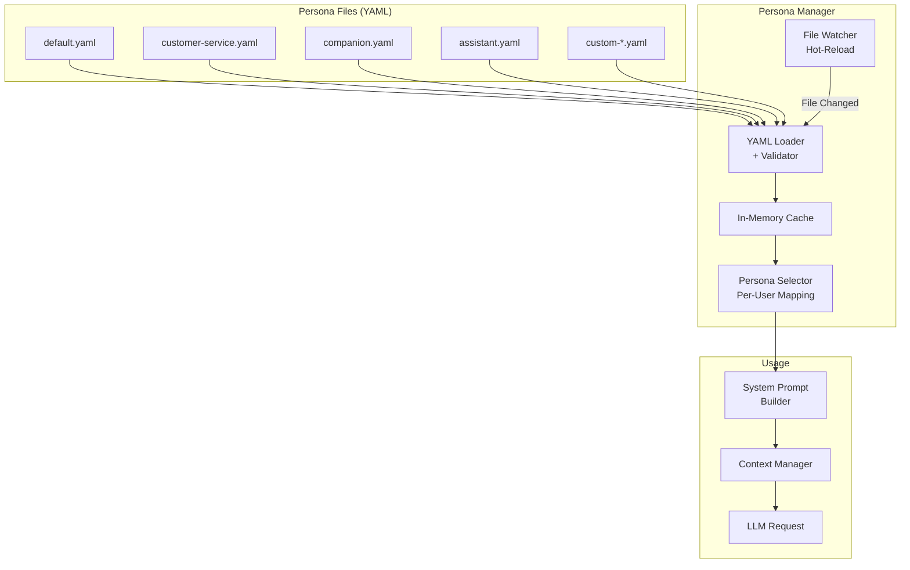

# Persona System Documentation — WA Persona AI

> Status: Draft
> Terakhir diperbarui: 2026-08-14
> Pemilik: Cloud-Dark

## 1. Overview

Persona system memungkinkan AI di WhatsApp memiliki kepribadian yang berbeda-beda. Setiap persona didefinisikan dalam file YAML yang berisi system prompt, traits, constraints, dan konfigurasi behavior.

## 2. Persona Architecture



## 3. Persona YAML Schema

Setiap persona file mengikuti schema berikut:

```yaml
# Metadata
name: string                    # Unique identifier (required)
display_name: string            # Human-readable name (required)
version: string                 # Persona version (required)
description: string             # Brief description (required)
author: string                  # Creator name (optional)

# Core Identity
system_prompt: |                # System prompt for LLM (required)
  Multi-line string defining the AI's role,
  personality, and instructions.

# Character Traits
traits:                         # List of personality traits (required)
  - trait_1
  - trait_2

# Language & Style
language:
  primary: string               # Primary language (e.g., "id", "en")
  style: string                 # Writing style (e.g., "casual", "formal")
  tone: string                  # Tone (e.g., "warm", "professional")
  use_emoji: boolean            # Whether to use emojis
  max_emoji_per_message: int    # Limit emojis per response

# Behavioral Constraints
constraints:
  allowed_topics: []            # Topics the persona CAN discuss (empty = all)
  blocked_topics: []            # Topics the persona CANNOT discuss
  max_response_length: int      # Maximum response length (tokens)
  response_style: string        # "concise" | "detailed" | "balanced"
  safety_level: string          # "strict" | "moderate" | "relaxed"

# Greeting
greeting:
  new_user: string              # Message for first-time users
  returning_user: string        # Message for returning users
  template_vars:                # Variables available in greeting
    - "{user_name}"
    - "{time_of_day}"

# Memory Integration
memory:
  enabled: boolean              # Whether this persona uses memory
  recall_style: string          # How to reference memories: "natural" | "explicit"
  importance_threshold: float   # Min importance score to store (0.0 - 1.0)

# LLM Settings (override global)
llm_overrides:
  temperature: float            # Override temperature
  max_tokens: int               # Override max response tokens
  model: string                 # Override model (optional)
```

## 4. File Structure

```
persona/
├── _schema.yaml                # Schema definition & validation rules
├── README.md                   # This documentation
├── default.yaml                # Default persona (fallback)
├── examples/
│   ├── assistant.yaml          # Professional assistant
│   ├── customer-service.yaml   # CS representative
│   ├── companion.yaml          # Friendly companion
│   ├── teacher.yaml            # Educational tutor
│   └── comedian.yaml           # Humor-focused persona
└── custom/                     # User-created personas (gitignored)
    └── .gitkeep
```

## 5. Creating a New Persona

1. Copy `persona/default.yaml` sebagai template
2. Edit sesuai kebutuhan
3. Simpan di `persona/` dengan nama unik
4. Bot akan auto-detect file baru (hot-reload)
5. Aktifkan via command: `!persona <name>`

## 6. Best Practices

- Tulis system prompt yang spesifik dan detail
- Definisikan batasan jelas (apa yang boleh dan tidak)
- Test persona dengan berbagai skenario percakapan
- Gunakan `constraints.blocked_topics` untuk keamanan
- Sesuaikan `temperature` — lower untuk formal, higher untuk kreatif

## 7. Referensi

- Lihat [03_FRD.md](../docs/03_FRD.md) FR-004 sampai FR-006 untuk requirements
- Lihat [05_ARCHITECTURE.md](../docs/05_ARCHITECTURE.md) untuk integrasi
